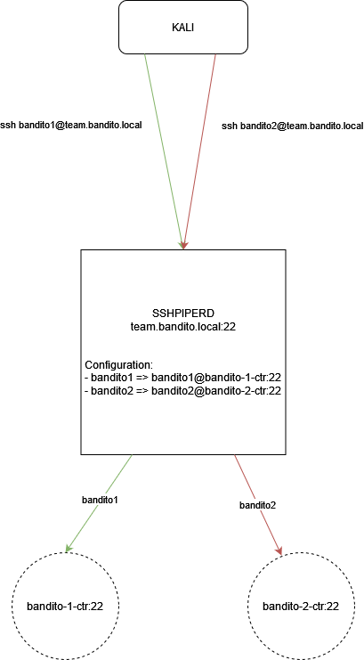

# bandit

A series of technical Linux challenges that were inspired from OverTheWire Bandit (check it out lowside, it's hella fun). Players will learn about linux vulnerabilities, privilege escalation, and various tools. 

This project uses a Docker image for each challenge rather than a single VM with all challenges on the same host. This creates an isolated and containerized challenge that is safe from misconfigurations of other challenges.  

## How does this work?

The base images required are:
- farmer1992/sshpiperd
- ubuntu:20.04
- stilliard/pure-ftpd

sshpiperd is a "reverse proxy for SSH" which enables us to transparently proxy SSH connections by mapping usernames authenticating to sshpiperd to upstream SSH servers (in this case, Docker containers).

A visual representation of this:



Any connections coming to sshpiperd with the username bandit1 will be routed to bandit1@bandit-1-ctr:22. `bandit-1-ctr` is a Docker image with SSH installed and a user `bandit1` configured. The same thing will continue for every subsequent challenge. 

## images

### sshpiperd

There are two options for the configuration files related to sshpiperd:
- build off of the base sshpiperd image with all of the configurations copied into the directory
- use the base image with the sshpiper directory but running the commands to list or add the configurations

Start up the sshpiperd container and execute the following commands. 

```bash
$ docker run -d -p 2222:2222 -v ./sshpiper:/var/sshpiper --name piper farmer1992/sshpiperd
$ docker exec piper /sshpiperd pipe list
$ docker exec piper /sshpiperd pipe add -n alice -p 2222 -u sshd_alice --upstream-username alice
```
*The above command expects the upstream docker container with the name `sshd_alice` to exist.*

The easier option is to create a directory with the configurations for ALL of the bandit challenges and build off of the base sshpiperd image

```
-- configs
-- -- bandit1
-- -- -- sshpiper_upstream
-- -- bandit2
-- -- -- sshpiper_upstream 
```
*Each sshpiper_upstream file should contain a line with the format `[username]@[upstream-docker-name]*
*The bandit1 and bandit2 are the usernames when you connect to the sshpiperd port and it'll map to the upstream directory*

Once you have the config directory prepared, build the following image by executing the following command from the root of this directory: `docker build -t bandit-sshpiper-img -f builds/sshpiper/Dockerfile builds/sshpiper`

### bandit - Base image

The base bandit challenge image is built off of Ubuntu 20.04 and performs a few steps such as:
- update, upgrade, and install essential packages
- install tmatrix
- create all bandit users and the directories for their passwords
- install and start SSH server
- CMD entry point

To build the image: `docker build -t bandit-base-img -f builds/base/Dockerfile builds/base.`

#### bandit Challenge image
From the bandit base image, we can create Dockerfile's for EACH bandit challenge. This builds off of the base image which contains the configuration for every user expect for the commands necessary for the challenge. 

```Dockerfile
FROM bandit-base-img:latest

ARG ARG_CURR_USER_USERNAME
ARG ARG_CURR_USER_PASSWORD
ARG ARG_NEXT_USER_USERNAME
ARG ARG_NEXT_USER_PASSWORD

# Insert remaining lines to create a vulnerable challenge with the above arguments
```

To build the image: `docker bandit-{challenge #}-img -f builds/bandit{challenge num}/Dockerfile builds/bandit{challenge num}`

## Utility Scripts

**In all utility scripts, the variable NUM_CHALLENGES must be modified to reflect the number of BANDIT challenges.**

The first utility script is located in the root directory (generate_configs.py) which is used to generate the configuration files prior to building the sshpiper image. Refer earlier in this README on why we need to generate these configs. The generate_configs.py script will create the configs directory, each individual username directory, and the sshpiper_upstream file with the contents as `bandit{challenge num}@bandit-{challenge num}-ctr:22`.

The second utility script is located in the root directory (generate_passwords.py) which generates the passwords for each user and saves the file in two locations. One in the root directory of the project and the second in builds/base. This is used to pass argument variables from the docker-compose.yml to the Dockerfile as well as when creating the users on the Docker images. 

## Docker Compose

Once you run the utility scripts, we can build the entire environment in one shot. Below is a sample docker-compose file. This assumes that the configuration sshpiper_upstream files contain the valid container name as specified below. 

```yaml

version: "3.9"                                                      
                                                                    
# A default set of variables for each environment                   
x-default-environment: &default-environment                         
  hostname: bandit.local                                            
  networks:                                                         
    - bandit                                                        
  depends_on:                                                       
    - bandit-base-img                                               
    - bandit-sshpiper                                               
  restart: always                                                   
                                                                    
services:                                                           
  # SSH reverse proxy service                                       
  bandit-sshpiper:                                                  
    image: bandit-sshpiper-img                                      
    container_name: bandit-sshpiper-ctr                             
    build:                                                          
      context: ./builds/sshpiper/                                   
    ports:                                                          
      - 2222:2222                                                   
    networks:                                                       
      - bandit                                                      
    restart: always                                                 
                                                                    
  # BASE image for each bandit related container                    
  bandit-base-img:                                                  
    image: bandit-base-img                                          
    build:                                                          
      context: ./builds/base/                                       
      args:                                                         
        - ARG_NUM_BANDIT_USERS=25                                   
    deploy:                                                         
      mode: replicated                                              
      replicas: 0                                                   
    depends_on:                                                     
      - bandit-sshpiper                                             
                                                                    
  # BANDIT 0 => BANDIT 1                                            
  bandit-0-ctr:                                                     
    image: bandit-0-img                                             
    container_name: bandit-0-ctr                                    
    build:                                                          
      context: ./builds/bandit0/                                    
      args:                                                         
        - ARG_CURR_USER_USERNAME=bandit0                            
        - ARG_CURR_USER_PASSWORD=${BANDIT0}                         
        - ARG_NEXT_USER_USERNAME=bandit1                            
        - ARG_NEXT_USER_PASSWORD=${BANDIT1}                         
    <<: *default-environment                                        
                                                                    
  # BANDIT 1 => BANDIT 2                                            
  bandit-1-ctr:                                                     
    image: bandit-1-img                                             
    container_name: bandit-1-ctr                                    
    build:                                                          
      context: ./builds/bandit1/                                    
      args:                                                         
        - ARG_CURR_USER_USERNAME=bandit1                            
        - ARG_CURR_USER_PASSWORD=${BANDIT1}                         
        - ARG_NEXT_USER_USERNAME=bandit2                            
        - ARG_NEXT_USER_PASSWORD=${BANDIT2}                         
    <<: *default-environment                               

networks:
  bandit:
```

Docker compose reads environment variables from the `.env` file located in the same directory as the docker-compose file. In the .env file, the password for each user is saved as `bandit#=[password]` which can be used as build arguments for the Dockerfiles.

To deploy everything, execute the following commands:
1. `python3 generate_configs.py`
2. `python3 generate_passwords.py`
3. `docker compose build bandit-base-img bandit-sshpiper`  # Let these build first
4. `docker compose build`
4. `docker compose up -d`

Once everything is deployed, connect to the first user with the following command. 

```
$ ssh bandit0@<IP> -p 2222 # The password for the first user is bandit0
```


# TEMPORARY FIX if SSHD complains about likeyutils.so.1 not loaded
# IDK why but this is a temporary fix because it doesn't occur on all systems. 

If this happens to you, do the following from the host you are building the container from

```
COPY libkeyutils.so.1.5 /lib/x86_64-linux-gnu/libkeyutils.so.1.5
RUN rm /lib/x86_64-linux-gnu/libkeyutils.so.1
RUN ln -s /lib/x86_64-linux-gnu/libkeyutils.so.1.5 /lib/x86_64-linux-gnu/libkeyutils.so.1
```
